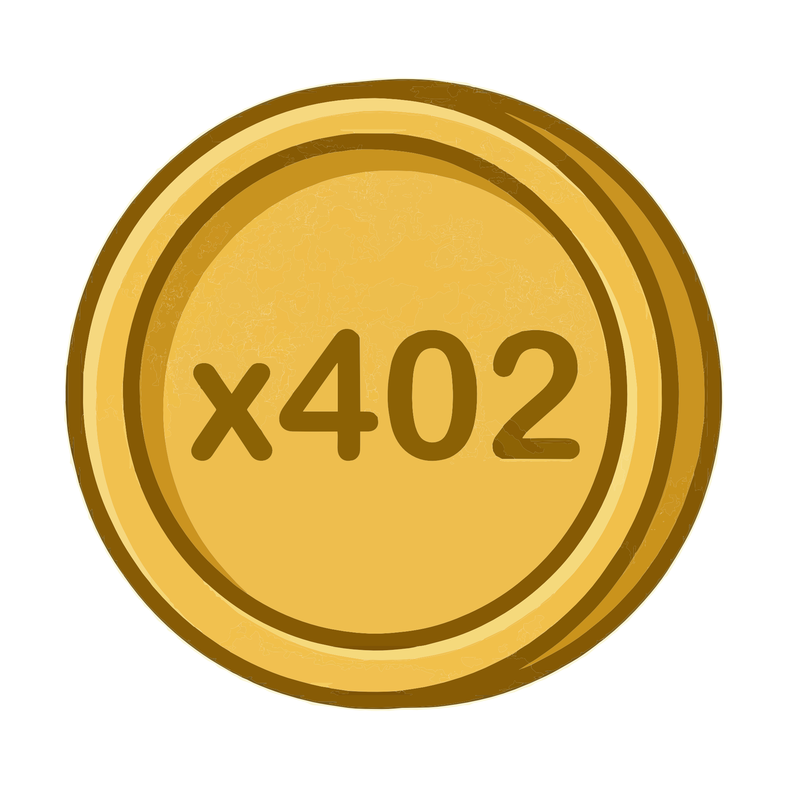

# x402

<p align="center">
  
</p>

<p align="center">
  <strong>The internet always had a payment status code. Now it has a token.</strong>
</p>

<p align="center">
  <a href="https://stellar.expert/explorer/public/asset/X402-GCQCPOO5E33CS76NJOAS4LIPAWJYIV4PKNOG53QGHGXWWFVJWW5MFSYX">
    
  </a>
  <a href="stellar.toml">
    
  </a>
  
  
</p>

---

## Overview

**x402** (`X402`) is a fixed-supply utility token on the [Stellar](https://stellar.org) blockchain, named after the HTTP `402 Payment Required` status code — a standard reserved since 1991 for a payments layer that never arrived on the web.

x402 fills that gap: a hard-capped, deflationary token purpose-built for machine-to-machine micropayments, API monetisation, and permissionless digital commerce.

---

## Token Details

| Parameter | Value |
|---|---|
| **Ticker** | `X402` |
| **Network** | Stellar Mainnet |
| **Issuer** | `GCQCPOO5E33CS76NJOAS4LIPAWJYIV4PKNOG53QGHGXWWFVJWW5MFSYX` |
| **Total Supply** | `8,000,000,000` |
| **Maximum Supply** | `8,000,000,000` (hard cap) |
| **Decimals** | `7` |
| **Inflation** | None — issuer account locked at genesis |
| **Auth Revocable** | Disabled — tokens cannot be frozen or clawed back |
| **Standard** | SEP-0001 (`stellar.toml`) |

---

## Repository Structure

```
x402/
├── index.html          # Landing page
├── stellar.toml        # Stellar SEP-0001 metadata (host at /.well-known/)
├── x402-icon.png       # Token logo
└── README.md           # This file
```

---

## stellar.toml

The `stellar.toml` file is the on-chain identity document for x402, following the [SEP-0001](https://github.com/stellar/stellar-protocol/blob/master/ecosystem/sep-0001.md) standard. It must be publicly hosted at:

```
https://yourdomain.com/.well-known/stellar.toml
```

with the HTTP header:

```
Access-Control-Allow-Origin: *
```

The file declares the issuer address, fixed supply, token logo, description, and conditions of use. Wallets and exchanges use this file to display verified token metadata.

---

## Key Properties

### Fixed Supply
The total supply of `8,000,000,000 X402` was issued at genesis. The issuing account's master key weight is set to `0`, making further minting cryptographically impossible — not just a policy promise.

You can verify this yourself:

```
https://stellar.expert/explorer/public/account/GCQCPOO5E33CS76NJOAS4LIPAWJYIV4PKNOG53QGHGXWWFVJWW5MFSYX
```

### Non-custodial
All token transfers occur peer-to-peer on the Stellar ledger. The issuer holds no user funds and cannot intercept or reverse transactions.

### No Freeze / No Clawback
`AUTH_REVOCABLE` is disabled. Once you hold X402, no authority can freeze your balance or claw tokens back from your account.

---

## Getting Started

### 1. Get a Stellar wallet
Download [Lobstr](https://lobstr.co), [Freighter](https://freighter.app), or any SEP-compliant wallet. Fund your account with a small XLM balance to cover transaction fees and reserves.

### 2. Add a trustline
Add a trustline to the X402 issuer:

```
GCQCPOO5E33CS76NJOAS4LIPAWJYIV4PKNOG53QGHGXWWFVJWW5MFSYX
```

This one-time operation costs `0.5 XLM` in account reserve and authorises your account to hold X402.

### 3. Acquire X402
Trade for X402 on the Stellar DEX using XLM, USDC, or any supported asset. Atomic settlement, no counterparty risk.

### 4. Send & receive
Pay APIs, settle between services, or hold. Transactions confirm in ~5 seconds with fees under `$0.0001`.

---

## Verify on-chain

| Resource | Link |
|---|---|
| Asset explorer | [stellar.expert — X402](https://stellar.expert/explorer/public/asset/X402-GCQCPOO5E33CS76NJOAS4LIPAWJYIV4PKNOG53QGHGXWWFVJWW5MFSYX) |
| Issuer account | [stellar.expert — Issuer](https://stellar.expert/explorer/public/account/GCQCPOO5E33CS76NJOAS4LIPAWJYIV4PKNOG53QGHGXWWFVJWW5MFSYX) |
| Stellar DEX | [Trade X402](https://stellarterm.com) |
| Stellar Docs | [developers.stellar.org](https://developers.stellar.org) |

---

## Deploying the Landing Page

The `index.html` is a single-file landing page with no dependencies or build step.

1. Place `index.html` and `x402-icon.png` in your web root.
2. Place `stellar.toml` at `/.well-known/stellar.toml`.
3. Ensure the server sets `Access-Control-Allow-Origin: *` on the `.well-known/` path.

That's it.

---

## Conditions of Use

1. **Fixed supply** — 8,000,000,000 X402 is the permanent maximum. No minting is possible.
2. **Utility only** — X402 is not equity, debt, or an investment contract. It confers no governance rights.
3. **Compliance** — Holders are solely responsible for compliance with applicable laws in their jurisdiction.
4. **No warranties** — X402 is provided as-is. The issuer is not liable for losses arising from use, exchange failures, or network outages.
5. **Trustline requirement** — Accounts must establish a trustline to receive X402.

See [`stellar.toml`](stellar.toml) for the full conditions.

---

## Disclaimer

X402 is a utility token. Nothing in this repository constitutes financial advice. Always verify on-chain data independently before transacting.

---

<p align="center">
  <code>HTTP 402 — Payment Required</code>
</p>
